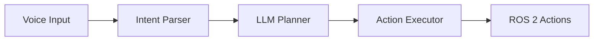

# Book Images and Diagrams

This directory contains images and diagrams for the Physical AI Book.

## Directory Structure

```
img/
├── architecture/     # System architecture diagrams
├── chapters/         # Chapter-specific images
├── diagrams/         # Technical diagrams
└── screenshots/      # Tool and simulation screenshots
```

## Planned Images

### Architecture Diagrams
- [ ] architecture-overview.png - Full system architecture
- [ ] chapter-flow.png - Learning path diagram
- [ ] capstone-components.png - 8-component integration diagram
- [ ] ros2-architecture.png - ROS 2 node graph

### Chapter Images
- [ ] ch01-ros2-concepts.png - ROS 2 concepts visualization
- [ ] ch02-gazebo-interface.png - Gazebo Sim screenshot
- [ ] ch03-perception-pipeline.png - Vision processing flow
- [ ] ch04-nav2-stack.png - Navigation stack diagram
- [ ] ch05-moveit2-planning.png - Motion planning visualization
- [ ] ch06-llm-flow.png - LLM integration architecture
- [ ] ch07-vla-pipeline.png - VLA model architecture
- [ ] ch08-capstone-demo.png - Final demo screenshot

## Image Guidelines

### Format
- Use PNG for diagrams and screenshots
- Use SVG for scalable diagrams (preferred)
- Use JPEG for photos (if needed)

### Size
- Max width: 1200px
- Recommended: 800px for inline images
- Diagrams: Export at 2x for retina displays

### Naming Convention
```
[chapter]-[topic]-[type].png
```
Examples:
- ch01-ros2-nodes-diagram.png
- ch02-gazebo-humanoid-screenshot.png

### Creating Diagrams

Recommended tools:
- **Mermaid**: For flow diagrams (embedded in Markdown)
- **draw.io**: For architecture diagrams
- **Excalidraw**: For hand-drawn style diagrams
- **Graphviz**: For node graphs

### Mermaid Example

Instead of images, use Mermaid in Markdown:



## Placeholder Note

This README serves as documentation.
Actual images will be added during the Polish phase (T115-T117).
